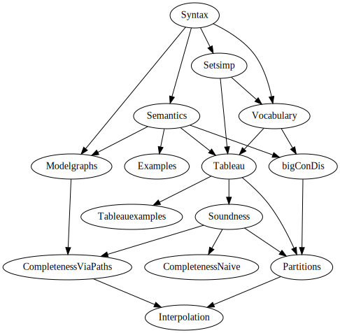

# Tableau for Basic Modal Logic in LEAN

NOTE: This folder contains a Lean 4 port of the original Lean 3 project
from <https://github.com/m4lvin/tablean>

That project was presented as:

- Malvin Gattinger:
  *A Verified Proof of Craig Interpolation for Basic Modal Logic via Tableaux in Lean*
  In: Advances in Modal Logic 2022, short presentation, 2022.
  ([PDF](https://malv.in/2022/AiML2022-basic-modal-interpolation-lean.pdf))

---

We formalise a tableau system for modal logic and prove soundness, completeness
and [Craig Interpolation](https://en.wikipedia.org/wiki/Craig_interpolation).

In this folder we only consider basic modal logic K, but the (very) long term goal is [Propositional Dynamic Logic](https://plato.stanford.edu/entries/logic-dynamic/) (PDL).
Therefore we try to follow the definitions and ideas from
[Borzechowski (1988/2020)](https://malv.in/2020/borzechowski-pdl/).

## Module dependency overview

## Inspiration / References / Related Work

- https://github.com/ljt12138/Formalization-PAL — see also https://arxiv.org/abs/2012.09388

- https://github.com/paulaneeley/modal — see also https://www.youtube.com/watch?v=kXCB5wzQTKc

- https://github.com/minchaowu/ModalTab — see also https://doi.org/10.4230/LIPIcs.ITP.2019.31

- https://github.com/bbentzen/mpl/ — see also https://arxiv.org/abs/1910.01697

- https://github.com/LudvikGalois/coq-CPL-NNF-tableau

- https://github.com/m4lvin/modal-tableau-interpolation

- https://github.com/FrancescaPerin/BScProject — see also https://fse.studenttheses.ub.rug.nl/20770/

## Acknowledgements

For their helpful advice and code hints I would like to thank
Alex J. Best,
Emma Brakkee,
Jasmin Blanchette,
Riccardo Brasca,
Kevin Buzzard,
Mario Carneiro,
Yaël Dillies,
Patrick Johnson,
Kyle Miller,
Eric Rodriguez,
Ruben Van de Velde,
Eric Wieser,
and all other friendly people at [leanprover.zulipchat.com](https://leanprover.zulipchat.com/).
