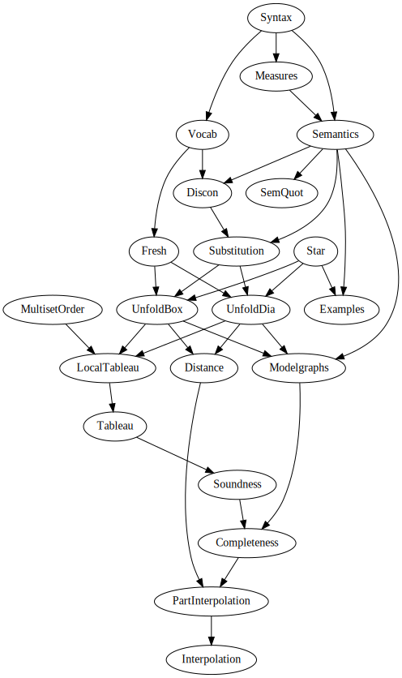

# Propositional Dynamic Logic in Lean 4

## Documentation

<https://m4lvin.github.io/lean4-pdl/docs/>

## Module dependency overview

(Run `make dependencies.svg` to update this.)

## References and Links

- https://malv.in/2020/borzechowski-pdl - the German original proof by Borzechowski (1988) and the English translation (2020)
- https://github.com/m4lvin/tablean - previous project for Basic Modal Logic, in Lean 3. Code from there has been ported to Lean 4 and is included here in the `Bml` folder.
- https://w4eg.de/malvin/illc/tapdleau - tableaux prover implemented in Haskell, useful to run examples.
